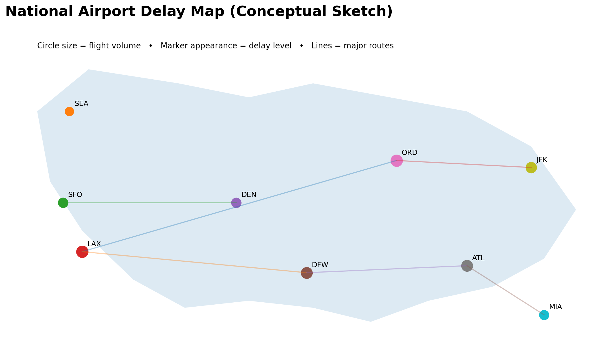
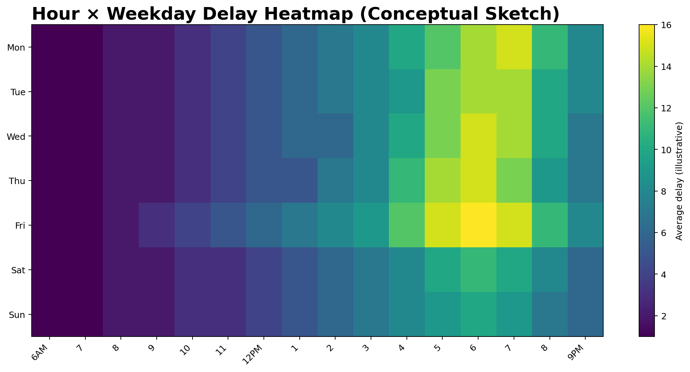
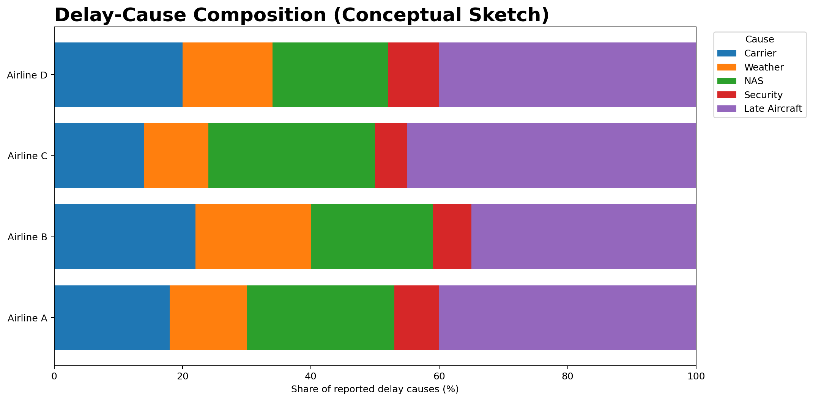
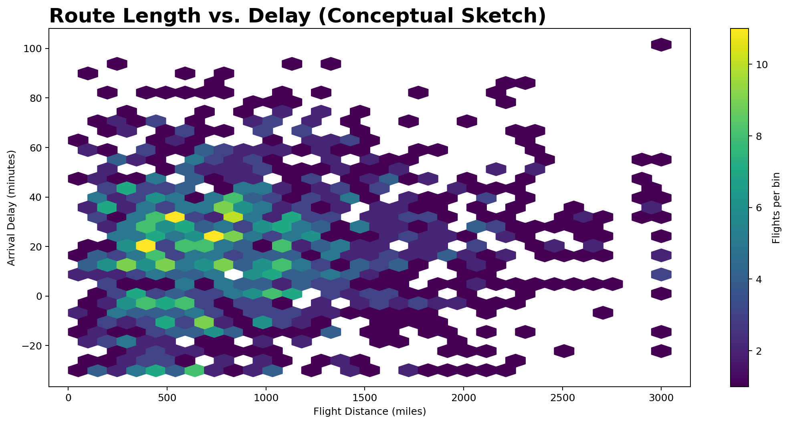
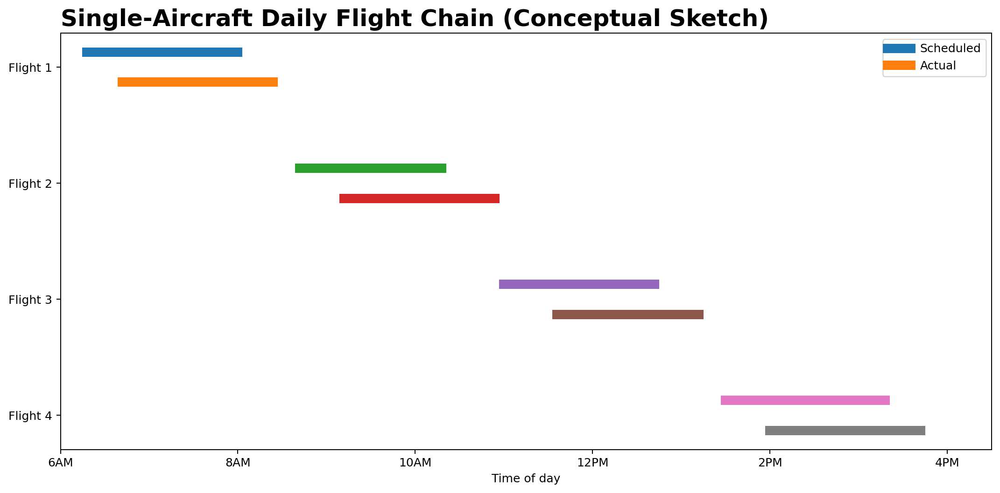

# US Flight Delays: From Symptoms to Source

**Group Members:** Tian Liang and Jiayang Sun

## 1. Topic, Goals, and Questions

Flight delays are a common frustration for travelers, but their causes are not always obvious. Delays may be associated with airports, airlines, weather, scheduling, or earlier flights operated by the same aircraft. Our project will explore where and when delays occur, how patterns differ across airlines and routes, what reported causes contribute to them, and whether delay appears to propagate through sequences of flights.

Our main visualization goal is to guide users from visible “symptoms” of delay toward possible sources. We will first show geographic and temporal patterns, then compare reported causes, examine the relationship between route length and delay, and finally trace selected aircraft across one day. The intended audience is frequent travelers, general readers, and students interested in transportation data.

**Exploration questions:**

- **Q1.** Which airports and regions experience the highest levels of flight delay?
- **Q2.** How do delay patterns vary by time of day, weekday, and season?
- **Q3.** How does flight distance relate to the severity and variability of delay?
- **Q4.** How do reported delay causes differ across airlines and airports?
- **Q5.** Can delay propagation be observed across flights operated by the same aircraft during one day?

## 2. Datasets

**Primary dataset: BTS Reporting Carrier On-Time Performance (2024).**

The U.S. Bureau of Transportation Statistics (BTS) publishes monthly flight-level data containing airports, airlines, scheduled and actual times, cancellations, distance, arrival and departure delays, and reported delay causes.

- Database: https://transtats.bts.gov/DatabaseInfo.asp?QO_VQ=EFD
- Fields: https://www.transtats.bts.gov/Fields.asp?gnoyr_VQ=FGJ

We will download the monthly 2024 files and combine them into a full-year dataset. The full dataset contains several million records, but only variables needed for our research questions will be retained.

Important attributes include `Origin`, `Dest`, `Reporting_Airline`, `Tail_Number`, `FlightDate`, `CRSDepTime`, `DepDelay`, `ArrDelay`, `Distance`, `Cancelled`, `CarrierDelay`, `WeatherDelay`, `NASDelay`, `SecurityDelay`, and `LateAircraftDelay`.

**Secondary dataset: OpenFlights airport database.**

This dataset provides airport latitude and longitude for mapping.

- Source: https://raw.githubusercontent.com/jpatokal/openflights/master/data/airports.dat

Processing will include combining monthly files, selecting variables, converting dates and times, handling missing values, separating cancelled flights, and joining airport coordinates. We will also use `Tail_Number` and flight times to order flights operated by the same aircraft.

## 3. Analysis and Visualization Methods

We plan to use **Python with pandas** for cleaning, transformation, aggregation, and exploratory analysis. The interactive website will use **HTML, CSS, JavaScript, and D3.js v7**. Geographic views will use TopoJSON and `us-atlas`. Aggregated files will be created so the browser does not need to load the complete raw dataset.

We will calculate delay frequency, average and median delay, cancellation rate, cause shares, and distributions by time, airport, airline, and route length. Because delay distributions may be skewed, robust summaries such as medians and interquartile ranges will also be considered.

The visualizations will support **comparison**, **filtering**, **trend identification**, **relationship discovery**, **exploration**, and **outlier detection**. Users will be able to filter selected views by airport, airline, and time period.

## 4. Visualization Sketches and References

The following digital mockups show our initial ideas. They are conceptual designs and may change after exploratory analysis.

### Visualization 1: National Airport Delay Map

**Technique:** Proportional-symbol map with route flows.  
**Purpose:** Shows where delays concentrate geographically and helps answer Q1.

### Visualization 2: Hour × Weekday Delay Heatmap

**Technique:** Matrix heatmap, filterable by month.  
**Purpose:** Reveals when delays are most severe and helps answer Q2.

### Visualization 3: Delay-Cause Composition

**Technique:** Normalized stacked bar chart.  
**Purpose:** Compares reported delay causes across airlines or airports and helps answer Q4.

### Visualization 4: Route Length vs. Delay

**Technique:** Hexbin-style relationship plot.  
**Purpose:** Examines how delay severity and variability differ across route lengths, addressing Q3.

### Visualization 5: Single-Aircraft Daily Flight Chain

**Technique:** Sequence / Gantt-style chart.  
**Purpose:** Shows whether an early delay persists, grows, or recovers across later flights, addressing Q5.

The five views are designed to work together. Selecting an airport on the map can filter the temporal, cause, and route-length views, while the aircraft-chain view will allow users to inspect selected flight sequences.

## 5. Group Roles and Responsibilities

- **Tian Liang** — data acquisition and cleaning, preprocessing and aggregation, airport-map implementation, and delay-cause visualization.
- **Jiayang Sun** — temporal heatmap, route-length visualization, aircraft-sequence visualization, and page/interface development.

Both members will contribute to D3.js implementation, interaction design, testing, documentation, question refinement, and presentation preparation.

## 6. Interim Presentation Deliverables

By the interim presentation, we expect to have the 2024 data acquired and cleaned, initial exploratory analysis, refined research questions, sketches for all five visualizations, and working D3.js prototypes for at least two views. We also plan to demonstrate basic filtering or linked interaction if feasible.

## 7. Timeline and Milestones

| Week | Milestone | Tasks | Responsible Member(s) | Expected Output |
|---|---|---|---|---|
| Week 2 | Project Definition | Finalize topic, questions, datasets, repository, and proposal | Both | Proposal, repository, sketches |
| Week 3 | Data Preparation | Download, combine, clean, and join airport coordinates | Tian lead; Jiayang assist | Clean dataset and scripts |
| Week 4 | Visualization Design | Conduct EDA and finalize five visualization designs | Both | EDA results and designs |
| Week 5 | Interim Prototype | Implement at least two D3.js views and prepare presentation | Both | Working prototype |
| Week 6 | Implementation & Refinement | Implement remaining views, filters, interactions, and interface | Both | Five functional views |
| Week 7 | Final Integration | Integrate, test, document, refine narrative, and rehearse presentation | Both | Final website, README, presentation |
